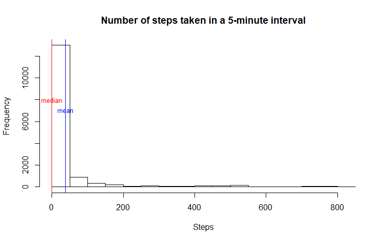
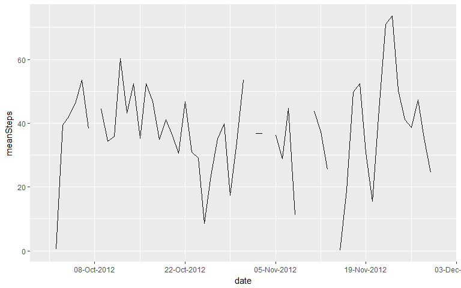
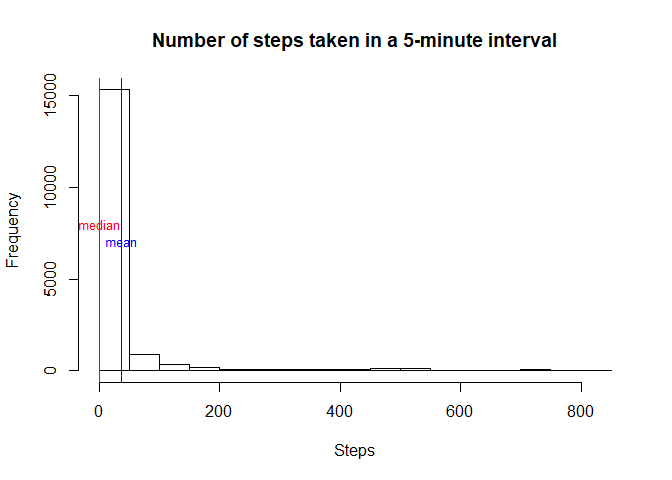
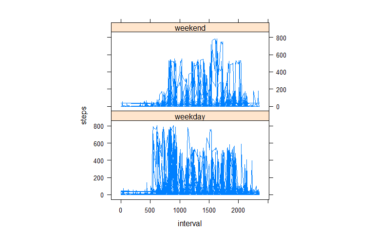

Activity monitoring data
========================

Loading and preprocessing the data
----------------------------------

``` r
library(dplyr)
library(lattice)
library(ggplot2)

setwd("D:/DSpecialization/ReproResearch/Week2")
activity <- read.csv("activity.csv")
```

What is mean total number of steps taken per day?
-------------------------------------------------

1.  Total number of steps taken per day

``` r
daySteps <- activity %>%
   group_by(date) %>%
   summarize(totalSteps = sum(steps, na.rm = TRUE))
sum(daySteps$totalSteps)
```

    ## [1] 570608

1.  Histogram of the total number of steps taken each day

``` r
stepsMean = mean(activity$steps, na.rm = TRUE)
stepsMedian = median(activity$steps, na.rm = TRUE)

hist(activity$steps, main="Number of steps taken in a 5-minute interval", xlab = "Steps")
abline(v = stepsMean, col = "blue")
text(stepsMean, 7000, "mean", col = "blue", cex = 0.8)
abline(v = stepsMedian, col = "red")
text(stepsMedian, 8000, "median",  col = "red", cex = 0.8)
```



1.  The mean of the steps distribution is $\\bar{x} = 37.38$ and the median is *M**e**d* = 0 as shown in the histogram above.

What is the average daily activity pattern?
-------------------------------------------

1.  Time series plot

``` r
averageIntervalSteps <- activity %>%
   group_by(date) %>%
   summarize(meanSteps = mean(steps, na.rm = TRUE)) %>%
   mutate(date = as.Date(date))
ggplot(averageIntervalSteps, aes(date, meanSteps)) + geom_line() + scale_x_date(date_breaks = "2 week", date_minor_breaks = "1 week", date_labels = "%d-%b-%Y")
```

    ## Warning: Removed 2 rows containing missing values (geom_path).



1.  Which 5-minute interval, on average across all the days in the dataset, contains the maximum number of steps?

``` r
maxAverageSteps <- averageIntervalSteps$date[which.max(averageIntervalSteps$meanSteps)]
format(as.Date(maxAverageSteps), format="%d-%b-%Y")
```

    ## [1] "23-Nov-2012"

Imputing missing values
-----------------------

1.  Number of missing values

``` r
sum(!complete.cases(activity))
```

    ## [1] 2304

1.  Inputing missing values by the mean of steps distribution ($\\bar{x} = 37.38$)

2.  New dataset that is equal to the original dataset but with the missing data filled in

``` r
new_activity <- activity

new_activity$steps[is.na(new_activity$steps)] <- mean(new_activity$steps, na.rm = TRUE)
```

Filled dataset

``` r
sum(!complete.cases(new_activity)) # Number of rows with NA's
```

    ## [1] 0

1.  Histogram of new dataset steps taken each day

``` r
new_stepsMean = mean(new_activity$steps, na.rm = TRUE)
new_stepsMedian = median(new_activity$steps, na.rm = TRUE)

hist(new_activity$steps, main="Number of steps taken in a 5-minute interval", xlab = "Steps")
abline(v = new_stepsMean, col = "blue")
text(new_stepsMean, 7000, "mean", col = "blue", cex = 0.8)
abline(v = new_stepsMedian, col = "red")
text(new_stepsMedian, 8000, "median",  col = "red", cex = 0.8)
```



Inputting the mean of all days over the missing values lets the average and the median in the same value as before ($\\bar{x} = 37.38$, *M**e**d* = 0). In this case, the measures of central tendency are not affected because of the method of inputting the mean but the distribution of steps change in a not so significant way.

It also changes a lot the total daily number of steps

``` r
sum(new_activity$steps)
```

    ## [1] 656737.5

Are there differences in activity patterns between weekdays and weekends?
-------------------------------------------------------------------------

1.  New variable indicating whether a given date is a weekday or weekend day.

``` r
new_activity$weekdays <- weekdays(as.Date(new_activity$date), abbreviate = TRUE) %in% c("Mon", "Tue", "Wed", "Thu", "Fri")

new_activity$weekdays[new_activity$weekdays == TRUE] <- "weekday"
new_activity$weekdays[new_activity$weekdays == FALSE] <- "weekend"

table(new_activity$weekdays)
```

    ## 
    ## weekday weekend 
    ##   12960    4608

1.  Number of steps on weekdays and weekends

``` r
new_averageIntervalSteps <- aggregate(data= new_activity, steps ~ weekdays, mean)
xyplot(steps ~ interval | weekdays, data = new_activity, aspect = 1/2, type = "l")
```


